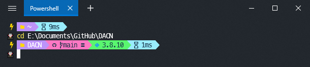

# Dracula theme for [Oh-My-Posh](https://github.com/JanDeDobbeleer/oh-my-posh)



## Usage

**Step 1:** You need to install [Oh-My-Posh](https://github.com/JanDeDobbeleer/oh-my-posh) first.

**Step 2:** Download dracula.omp.json and move this file to:

```powershell
%USERPROFILE%\Documents\WindowsPowerShell\<Version>\Modules\oh-my-posh\<Version>\themes
```

<b>Note:</b>`Version`Depending on your version.

**Step 3:** Set theme in your profile.

```powershell
Set-PoshPrompt -Theme dracula
```

My profile configurations:

```powershell
Import-Module posh-git
Import-Module oh-my-posh

Set-PoshPrompt -Theme dracula
```

## Terminal & Font

- Terminal: [Fluent Terminal](https://github.com/felixse/FluentTerminal) or Windows Terminal.

- Font : [Meslo LGM NF](https://github.com/ryanoasis/nerd-fonts/releases/download/v2.1.0/Meslo.zip).

## Author

[Laugh](https://github.com/laugh12321)